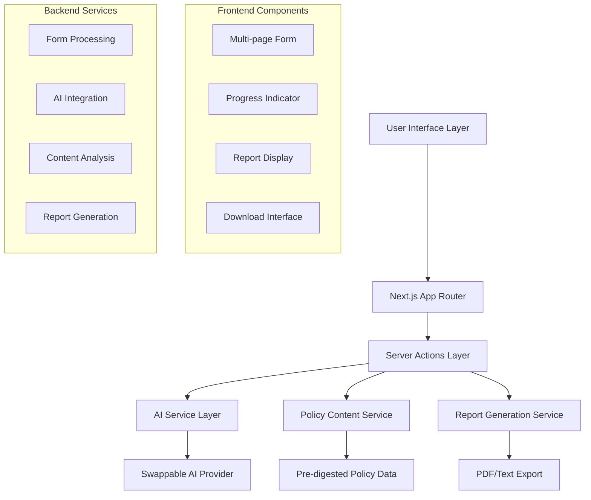

# Design Document

## Overview

AddressMe is a mobile-first Next.js 15 web application that provides personalized AI-powered summaries of Hong Kong's Policy Address. The application follows a three-phase user journey: profile collection through a multi-page form, AI-powered analysis, and personalized report generation with download capabilities.

The design emphasizes user experience with smooth animations, professional styling, and responsive design optimized for mobile devices while maintaining desktop compatibility.

## Architecture

### High-Level Architecture



### Technology Stack

- **Frontend**: Next.js 15 with App Router, React 19, TypeScript
- **Styling**: Tailwind CSS 4 with custom color scheme
- **Fonts**: Geist Sans and Geist Mono
- **AI Integration**: Swappable provider architecture (initially OpenAI/Anthropic)
- **PDF Generation**: React-PDF or Puppeteer for report downloads
- **Animations**: Framer Motion for smooth transitions
- **Form Management**: React Hook Form with Zod validation

## Components and Interfaces

### Core Components

#### 1. Multi-page Form System
```typescript
interface UserProfile {
  age: number;
  gender: 'male' | 'female' | 'other' | 'prefer-not-to-say';
  maritalStatus: 'single' | 'married' | 'divorced' | 'widowed';
  district: HongKongDistrict;
  incomeRange: IncomeRange;
  employmentStatus: EmploymentStatus;
  housingType: HousingType;
  hasChildren: boolean;
  childrenAges?: number[];
  educationLevel: EducationLevel;
  healthConditions?: string[];
  transportationMode: TransportationMode[];
}

interface FormStep {
  id: string;
  title: string;
  description: string;
  fields: FormField[];
  validation: ZodSchema;
}
```

#### 2. AI Service Interface
```typescript
// Functional AI provider configuration
type AIProviderConfig = {
  name: string;
  apiKey: string;
  options?: Record<string, any>;
};

// Pure function for AI summary generation
type GenerateSummary = (
  profile: UserProfile, 
  policyContent: PolicyContent, 
  config: AIProviderConfig
) => Promise<PersonalizedSummary>;

interface PersonalizedSummary {
  overallScore: number; // 70-100
  relevantAreas: PolicyArea[];
  majorUpdates: CityPlan[];
  recommendations: Recommendation[];
  generatedAt: Date;
}
```

#### 3. Report Components
```typescript
interface PolicyArea {
  category: 'housing' | 'transportation' | 'healthcare' | 'education' | 'employment' | 'social-welfare';
  title: string;
  relevanceScore: number;
  summary: string;
  details: string;
  actionItems: string[];
  impact: 'high' | 'medium' | 'low';
}
```

### Page Structure

#### 1. Landing Page (`/`)
- Hero section with clear value proposition
- "Start Assessment" CTA button
- Brief explanation of the process
- Professional blue gradient background

#### 2. Form Journey (`/assessment/[step]`)
- Dynamic routing for form steps
- Progress indicator at top
- Single question per page with engaging visuals
- Smooth page transitions
- Back/Next navigation

#### 3. Processing Page (`/processing`)
- Loading animation with progress updates
- "Analyzing your profile..." messaging
- Estimated completion time

#### 4. Report Page (`/report/[id]`)
- Overall score display with visual indicator
- Expandable sections for each policy area
- Download buttons (PDF/Text)
- "Retake Assessment" option

## Data Models

### Policy Content Structure
```typescript
interface PolicyContent {
  year: string;
  sections: PolicySection[];
  lastUpdated: Date;
}

interface PolicySection {
  id: string;
  category: PolicyCategory;
  title: string;
  content: string;
  targetDemographics: string[];
  impactLevel: 'high' | 'medium' | 'low';
  implementationTimeline: string;
}
```

### User Session Management
```typescript
interface UserSession {
  id: string;
  profile: UserProfile;
  summary?: PersonalizedSummary;
  createdAt: Date;
  expiresAt: Date;
}
```

## Error Handling

### Client-Side Error Handling
- Form validation with real-time feedback
- Network error recovery with retry mechanisms
- Graceful degradation for JavaScript disabled users
- Loading states for all async operations

### Server-Side Error Handling
- AI service fallback mechanisms
- Rate limiting with user-friendly messages
- Input sanitization and validation
- Comprehensive error logging

### Error Boundaries
```typescript
type ErrorBoundaryProps = {
  fallback: React.ComponentType<{error: Error}>;
  onError?: (error: Error) => void;
};

// Pure error handling functions
type HandleError = (error: Error, context: string) => void;
type RecoverFromError = (error: Error) => Promise<void>;
```

## Testing Strategy

### Unit Testing
- Component testing with React Testing Library
- Server action testing with Jest
- AI service mock implementations
- Form validation testing

### Integration Testing
- End-to-end form flow testing
- AI integration testing with mock responses
- PDF generation testing
- Mobile responsiveness testing

### Performance Testing
- Core Web Vitals monitoring
- AI response time optimization
- Bundle size optimization
- Mobile performance testing

## Security Considerations

### Input Validation
- Zod schema validation on both client and server
- SQL injection prevention (though no database planned)
- XSS protection through React's built-in sanitization
- CSRF protection via Next.js built-in features

### Rate Limiting
```typescript
type RateLimitConfig = {
  windowMs: number;
  maxRequests: number;
  skipSuccessfulRequests: boolean;
};

// Pure function for rate limiting
type CheckRateLimit = (
  identifier: string, 
  config: RateLimitConfig
) => Promise<{ allowed: boolean; remaining: number; resetTime: number }>;
```

### Data Privacy
- No persistent storage of personal data
- Session-based temporary storage only
- AI provider data handling compliance
- Clear data retention policies

## Styling System

### Color Palette
```css
:root {
  --primary-blue: #1e40af;
  --primary-blue-light: #3b82f6;
  --primary-blue-dark: #1e3a8a;
  
  --secondary-green: #059669;
  --secondary-green-light: #10b981;
  --secondary-green-dark: #047857;
  
  --accent-orange: #ea580c;
  --accent-orange-light: #f97316;
  --accent-orange-dark: #c2410c;
  
  --neutral-50: #f8fafc;
  --neutral-100: #f1f5f9;
  --neutral-900: #0f172a;
}
```

### Typography Scale
- Headings: Geist Sans (font-weight: 600-700)
- Body text: Geist Sans (font-weight: 400-500)
- Code/Data: Geist Mono (font-weight: 400)

### Animation System
- Page transitions: 300ms ease-in-out
- Form field focus: 150ms ease-out
- Button interactions: 100ms ease-in-out
- Section toggles: 250ms ease-in-out

## Performance Optimization

### Code Splitting
- Dynamic imports for heavy components
- Route-based code splitting
- AI provider lazy loading

### Caching Strategy
- Static policy content caching
- AI response caching (with user consent)
- Image optimization with Next.js Image component

### Mobile Optimization
- Touch-friendly interface design
- Optimized bundle size for mobile networks
- Progressive Web App capabilities
- Offline-first form data persistence

## Functional Programming Approach

### Core Principles
- Pure functions for all business logic
- Immutable data structures
- Function composition for complex operations
- Type-safe functional utilities

### Service Functions
```typescript
// Pure functions for core services
type ProcessUserProfile = (profile: UserProfile) => ProcessedProfile;
type AnalyzePolicyRelevance = (profile: ProcessedProfile, content: PolicyContent) => PolicyAnalysis;
type GenerateRecommendations = (analysis: PolicyAnalysis) => Recommendation[];
type FormatReport = (summary: PersonalizedSummary) => FormattedReport;

// Function composition for the main flow
type GeneratePersonalizedReport = (
  profile: UserProfile,
  policyContent: PolicyContent,
  aiConfig: AIProviderConfig
) => Promise<PersonalizedSummary>;
```