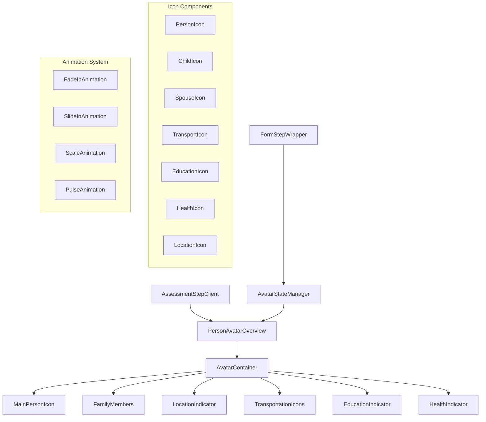

# Design Document

## Overview

The Dynamic Person Avatar feature enhances the Address Me assessment form by providing a real-time visual representation of the user that builds progressively as they complete each step. The avatar system uses SVG-based icons and smooth animations to create an engaging, personalized experience that reflects the user's demographic and lifestyle choices.

The design integrates seamlessly with the existing form architecture while maintaining the application's professional blue, green, and orange color scheme. The avatar serves as both a progress indicator and an engaging visual element that makes the form completion process more interactive and memorable.

## Architecture

### Component Architecture



### State Management

```typescript
interface AvatarState {
  // Personal characteristics
  gender: 'male' | 'female' | 'other' | 'neutral' | null;
  age: number | null;
  
  // Family structure
  maritalStatus: 'single' | 'married' | 'divorced' | 'widowed' | null;
  hasChildren: boolean;
  childrenCount: number;
  
  // Location and lifestyle
  district: string | null;
  incomeRange: string | null;
  educationLevel: string | null;
  transportationModes: string[];
  healthConditions: string[];
  
  // Visual state
  isAnimating: boolean;
  completedSteps: string[];
}

interface AvatarConfig {
  colors: {
    primary: string;
    secondary: string;
    accent: string;
    neutral: string;
  };
  animations: {
    duration: number;
    easing: string;
  };
  layout: {
    containerSize: { width: number; height: number };
    iconSizes: Record<string, number>;
    spacing: number;
  };
}
```

## Components and Interfaces

### Core Avatar Components

#### 1. PersonAvatarOverview
```typescript
interface PersonAvatarOverviewProps {
  formData: Partial<UserProfile>;
  currentStep: string;
  className?: string;
}

const PersonAvatarOverview: React.FC<PersonAvatarOverviewProps> = ({
  formData,
  currentStep,
  className
}) => {
  const avatarState = useAvatarState(formData, currentStep);
  const config = useAvatarConfig();
  
  return (
    <div className={cn("avatar-overview", className)}>
      <AvatarContainer state={avatarState} config={config} />
    </div>
  );
};
```

#### 2. AvatarContainer
```typescript
interface AvatarContainerProps {
  state: AvatarState;
  config: AvatarConfig;
}

const AvatarContainer: React.FC<AvatarContainerProps> = ({ state, config }) => {
  return (
    <div className="relative w-full h-64 bg-gradient-to-b from-blue-50 to-blue-100 rounded-lg p-4">
      <MainPersonIcon state={state} config={config} />
      {state.maritalStatus === 'married' && (
        <SpouseIcon state={state} config={config} />
      )}
      {state.hasChildren && (
        <FamilyMembers state={state} config={config} />
      )}
      <IndicatorGroup state={state} config={config} />
    </div>
  );
};
```

### Icon System

#### 1. SVG Icon Components
```typescript
interface IconProps {
  size?: number;
  color?: string;
  className?: string;
  animate?: boolean;
}

// Main person icons
const MaleIcon: React.FC<IconProps> = ({ size = 48, color = "#1e40af", className, animate }) => (
  <svg width={size} height={size} className={cn("transition-all duration-300", className)}>
    {/* SVG path for male figure */}
  </svg>
);

const FemaleIcon: React.FC<IconProps> = ({ size = 48, color = "#1e40af", className, animate }) => (
  <svg width={size} height={size} className={cn("transition-all duration-300", className)}>
    {/* SVG path for female figure */}
  </svg>
);

// Transportation icons
const BusIcon: React.FC<IconProps> = ({ size = 24, color = "#059669" }) => (
  <svg width={size} height={size}>
    {/* SVG path for bus */}
  </svg>
);

const MTRIcon: React.FC<IconProps> = ({ size = 24, color = "#059669" }) => (
  <svg width={size} height={size}>
    {/* SVG path for MTR train */}
  </svg>
);

// Education and health icons
const GraduationCapIcon: React.FC<IconProps> = ({ size = 20, color = "#ea580c" }) => (
  <svg width={size} height={size}>
    {/* SVG path for graduation cap */}
  </svg>
);

const MedicalIcon: React.FC<IconProps> = ({ size = 20, color = "#dc2626" }) => (
  <svg width={size} height={size}>
    {/* SVG path for medical cross */}
  </svg>
);
```

#### 2. Icon Mapping System
```typescript
const ICON_MAPPINGS = {
  gender: {
    male: MaleIcon,
    female: FemaleIcon,
    other: NeutralIcon,
    'prefer-not-to-say': NeutralIcon,
  },
  transportation: {
    mtr: MTRIcon,
    bus: BusIcon,
    minibus: MinibusIcon,
    taxi: TaxiIcon,
    'private-car': CarIcon,
    bicycle: BikeIcon,
    walking: WalkingIcon,
  },
  education: {
    primary: BookIcon,
    secondary: BookIcon,
    'post-secondary': DiplomaIcon,
    bachelor: GraduationCapIcon,
    master: GraduationCapIcon,
    doctorate: GraduationCapIcon,
  },
  health: {
    diabetes: MedicalIcon,
    mobility: AccessibilityIcon,
    chronic: MedicalIcon,
  },
  district: {
    'central-western': BuildingIcon,
    'wan-chai': BuildingIcon,
    // ... other districts
  },
} as const;
```

### Animation System

#### 1. Animation Hooks
```typescript
const useAvatarAnimations = (state: AvatarState) => {
  const [animatingElements, setAnimatingElements] = useState<Set<string>>(new Set());
  
  const animateElement = useCallback((elementId: string) => {
    setAnimatingElements(prev => new Set(prev).add(elementId));
    
    setTimeout(() => {
      setAnimatingElements(prev => {
        const next = new Set(prev);
        next.delete(elementId);
        return next;
      });
    }, 300);
  }, []);
  
  return { animatingElements, animateElement };
};
```

#### 2. Animation Components
```typescript
interface AnimatedElementProps {
  children: React.ReactNode;
  animationType: 'fadeIn' | 'slideIn' | 'scale' | 'pulse';
  duration?: number;
  delay?: number;
  trigger?: boolean;
}

const AnimatedElement: React.FC<AnimatedElementProps> = ({
  children,
  animationType,
  duration = 300,
  delay = 0,
  trigger = true,
}) => {
  const [isVisible, setIsVisible] = useState(false);
  
  useEffect(() => {
    if (trigger) {
      const timer = setTimeout(() => setIsVisible(true), delay);
      return () => clearTimeout(timer);
    }
  }, [trigger, delay]);
  
  const animationClasses = {
    fadeIn: isVisible ? 'opacity-100' : 'opacity-0',
    slideIn: isVisible ? 'translate-x-0' : 'translate-x-4',
    scale: isVisible ? 'scale-100' : 'scale-0',
    pulse: isVisible ? 'animate-pulse' : '',
  };
  
  return (
    <div
      className={cn(
        'transition-all ease-in-out',
        animationClasses[animationType]
      )}
      style={{ transitionDuration: `${duration}ms` }}
    >
      {children}
    </div>
  );
};
```

## Data Models

### Avatar State Management
```typescript
interface AvatarStateManager {
  state: AvatarState;
  updateFromFormData: (formData: Partial<UserProfile>) => void;
  getVisibleElements: () => string[];
  shouldAnimate: (elementId: string) => boolean;
}

const createAvatarStateManager = (initialState?: Partial<AvatarState>): AvatarStateManager => {
  let state: AvatarState = {
    gender: null,
    age: null,
    maritalStatus: null,
    hasChildren: false,
    childrenCount: 0,
    district: null,
    incomeRange: null,
    educationLevel: null,
    transportationModes: [],
    healthConditions: [],
    isAnimating: false,
    completedSteps: [],
    ...initialState,
  };
  
  const updateFromFormData = (formData: Partial<UserProfile>) => {
    const newState = { ...state };
    
    // Update state based on form data
    if (formData.gender) newState.gender = formData.gender;
    if (formData.age) newState.age = formData.age;
    if (formData.maritalStatus) newState.maritalStatus = formData.maritalStatus;
    if (formData.hasChildren !== undefined) {
      newState.hasChildren = formData.hasChildren;
      newState.childrenCount = formData.childrenAges?.length || 0;
    }
    if (formData.district) newState.district = formData.district;
    if (formData.educationLevel) newState.educationLevel = formData.educationLevel;
    if (formData.transportationMode) newState.transportationModes = formData.transportationMode;
    if (formData.healthConditions) newState.healthConditions = formData.healthConditions;
    
    state = newState;
  };
  
  const getVisibleElements = (): string[] => {
    const elements: string[] = [];
    
    if (state.gender) elements.push('main-person');
    if (state.maritalStatus === 'married') elements.push('spouse');
    if (state.hasChildren) elements.push('children');
    if (state.district) elements.push('location');
    if (state.transportationModes.length > 0) elements.push('transportation');
    if (state.educationLevel) elements.push('education');
    if (state.healthConditions.length > 0) elements.push('health');
    
    return elements;
  };
  
  const shouldAnimate = (elementId: string): boolean => {
    return !state.completedSteps.includes(elementId);
  };
  
  return {
    state,
    updateFromFormData,
    getVisibleElements,
    shouldAnimate,
  };
};
```

### Mock Profile Configuration
```typescript
const MOCK_PROFILE: UserProfile = {
  age: 30,
  gender: 'male',
  maritalStatus: 'single',
  district: 'central-western',
  incomeRange: '20k-30k',
  employmentStatus: 'employed-full-time',
  housingType: 'private-rental',
  hasChildren: true,
  childrenAges: [5],
  educationLevel: 'bachelor',
  transportationMode: ['bus', 'mtr'],
  healthConditions: ['diabetes'],
};

const getMockAvatarState = (): AvatarState => ({
  gender: 'male',
  age: 30,
  maritalStatus: 'single',
  hasChildren: true,
  childrenCount: 1,
  district: 'central-western',
  incomeRange: '20k-30k',
  educationLevel: 'bachelor',
  transportationModes: ['bus', 'mtr'],
  healthConditions: ['diabetes'],
  isAnimating: false,
  completedSteps: [],
});
```

## Error Handling

### Avatar Rendering Fallbacks
```typescript
const AvatarErrorBoundary: React.FC<{ children: React.ReactNode }> = ({ children }) => {
  return (
    <ErrorBoundary
      fallback={({ error }) => (
        <div className="w-full h-64 bg-gray-100 rounded-lg flex items-center justify-center">
          <div className="text-center">
            <div className="w-16 h-16 bg-gray-300 rounded-full mx-auto mb-2" />
            <p className="text-sm text-gray-600">Avatar preview unavailable</p>
          </div>
        </div>
      )}
      onError={(error) => console.error('Avatar rendering error:', error)}
    >
      {children}
    </ErrorBoundary>
  );
};
```

### Icon Loading States
```typescript
const IconWithFallback: React.FC<{
  icon: React.ComponentType<IconProps>;
  fallback?: React.ReactNode;
  props: IconProps;
}> = ({ icon: Icon, fallback, props }) => {
  const [hasError, setHasError] = useState(false);
  
  if (hasError) {
    return fallback || <div className="w-6 h-6 bg-gray-300 rounded" />;
  }
  
  return (
    <Suspense fallback={<div className="w-6 h-6 bg-gray-200 rounded animate-pulse" />}>
      <Icon {...props} onError={() => setHasError(true)} />
    </Suspense>
  );
};
```

## Testing Strategy

### Component Testing
```typescript
describe('PersonAvatarOverview', () => {
  it('should render placeholder when no form data provided', () => {
    render(<PersonAvatarOverview formData={{}} currentStep="personal-info" />);
    expect(screen.getByTestId('avatar-placeholder')).toBeInTheDocument();
  });
  
  it('should update avatar when gender is selected', () => {
    const { rerender } = render(
      <PersonAvatarOverview formData={{}} currentStep="personal-info" />
    );
    
    rerender(
      <PersonAvatarOverview 
        formData={{ gender: 'male' }} 
        currentStep="personal-info" 
      />
    );
    
    expect(screen.getByTestId('male-icon')).toBeInTheDocument();
  });
  
  it('should animate new elements when they appear', async () => {
    const { rerender } = render(
      <PersonAvatarOverview formData={{ gender: 'male' }} currentStep="personal-info" />
    );
    
    rerender(
      <PersonAvatarOverview 
        formData={{ gender: 'male', maritalStatus: 'married' }} 
        currentStep="personal-info" 
      />
    );
    
    const spouseIcon = screen.getByTestId('spouse-icon');
    expect(spouseIcon).toHaveClass('animate-fadeIn');
  });
});
```

### Integration Testing
```typescript
describe('Avatar Integration', () => {
  it('should work with complete mock profile', () => {
    render(
      <PersonAvatarOverview 
        formData={MOCK_PROFILE} 
        currentStep="health" 
      />
    );
    
    expect(screen.getByTestId('male-icon')).toBeInTheDocument();
    expect(screen.getByTestId('child-icon')).toBeInTheDocument();
    expect(screen.getByTestId('bus-icon')).toBeInTheDocument();
    expect(screen.getByTestId('mtr-icon')).toBeInTheDocument();
    expect(screen.getByTestId('graduation-cap-icon')).toBeInTheDocument();
    expect(screen.getByTestId('medical-icon')).toBeInTheDocument();
  });
});
```

## Performance Optimization

### Icon Optimization
- SVG icons optimized for minimal file size
- Icon sprites for commonly used elements
- Lazy loading for complex animations
- Memoization of icon components

### Animation Performance
```typescript
const useOptimizedAnimations = () => {
  const prefersReducedMotion = useMediaQuery('(prefers-reduced-motion: reduce)');
  
  return {
    duration: prefersReducedMotion ? 0 : 300,
    easing: prefersReducedMotion ? 'linear' : 'ease-in-out',
    enabled: !prefersReducedMotion,
  };
};
```

### Memory Management
```typescript
const useAvatarState = (formData: Partial<UserProfile>, currentStep: string) => {
  return useMemo(() => {
    const manager = createAvatarStateManager();
    manager.updateFromFormData(formData);
    return manager.state;
  }, [formData, currentStep]);
};
```

## Accessibility

### Screen Reader Support
```typescript
const AvatarDescription: React.FC<{ state: AvatarState }> = ({ state }) => {
  const description = useMemo(() => {
    const parts: string[] = [];
    
    if (state.gender) parts.push(`${state.gender} person`);
    if (state.maritalStatus === 'married') parts.push('with spouse');
    if (state.hasChildren) parts.push(`with ${state.childrenCount} child${state.childrenCount > 1 ? 'ren' : ''}`);
    if (state.transportationModes.length > 0) {
      parts.push(`uses ${state.transportationModes.join(' and ')}`);
    }
    
    return parts.join(', ');
  }, [state]);
  
  return (
    <div className="sr-only" aria-live="polite">
      Avatar showing: {description}
    </div>
  );
};
```

### Keyboard Navigation
- Focus management for interactive elements
- Skip links for avatar section
- High contrast mode support

## Integration Points

### Form Integration
```typescript
// In AssessmentStepClient.tsx
const AssessmentStepClient = () => {
  const [formData, setFormData] = useState<Partial<UserProfile>>({});
  const params = useParams();
  
  return (
    <div className="grid grid-cols-1 lg:grid-cols-3 gap-6">
      <div className="lg:col-span-2">
        <FormStepWrapper 
          step={stepConfig} 
          onDataChange={setFormData}
        />
      </div>
      <div className="lg:col-span-1">
        <PersonAvatarOverview 
          formData={formData}
          currentStep={params.step as string}
        />
      </div>
    </div>
  );
};
```

### State Synchronization
```typescript
const useFormAvatarSync = () => {
  const { formData } = useFormContext();
  const [avatarState, setAvatarState] = useState<AvatarState>(initialAvatarState);
  
  useEffect(() => {
    const manager = createAvatarStateManager(avatarState);
    manager.updateFromFormData(formData);
    setAvatarState(manager.state);
  }, [formData]);
  
  return avatarState;
};
```